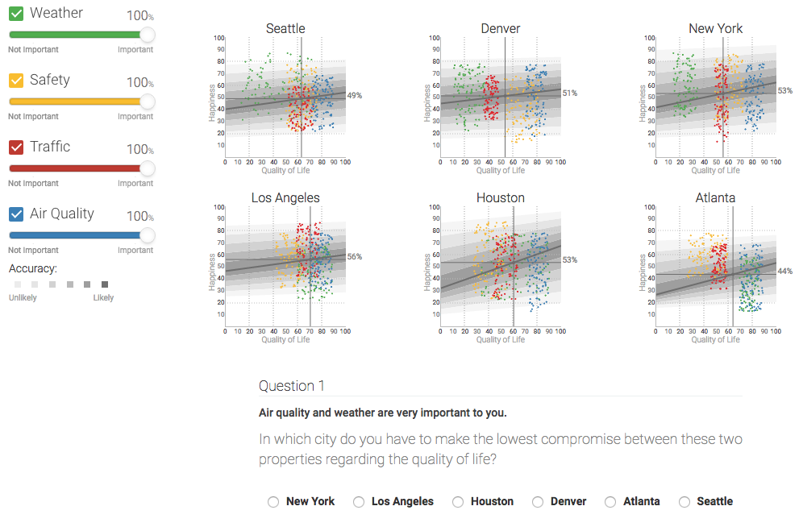
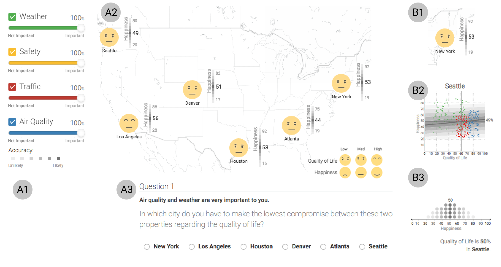
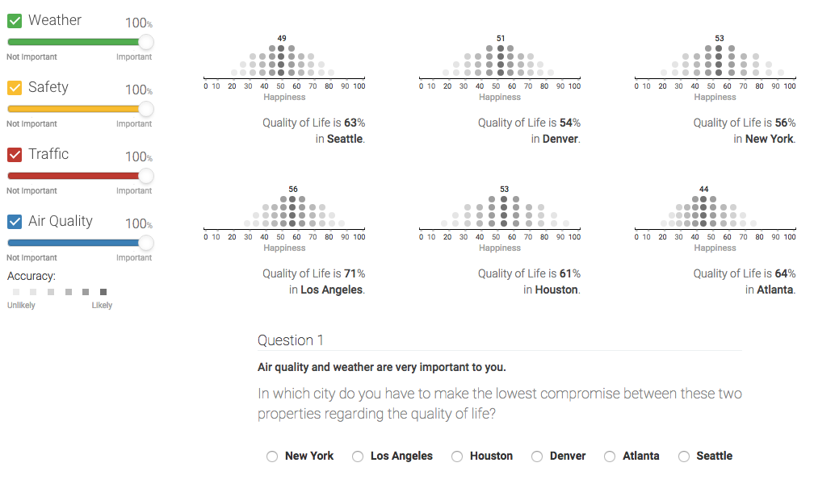

# LifeQualityViz

The dashboards are **available online** in the following links:

- Intuitive: http://life.ahci.work/map
- Detailed:  http://life.ahci.work/charts
- Compact:   http://life.ahci.work/dots

A dashboard to predict people's happiness in different cities across the U.S. using different viusalizations.

### Linear regression plot:

### Chernoff Faces:

### Dotplot viz to represent probability:

